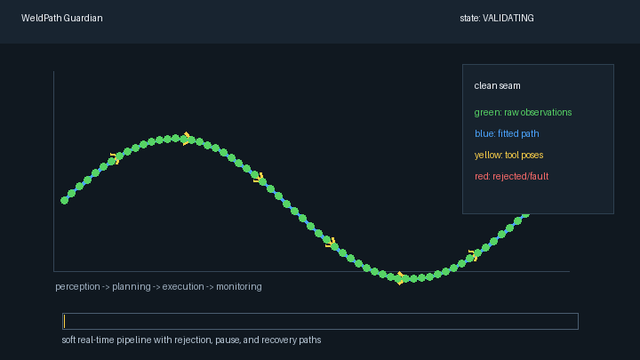

# WeldPath Guardian

[](https://github.com/kaus-h/WeldPathGuardian/actions/workflows/ros2-ci.yml)

WeldPath Guardian is a C++20/ROS 2 simulation of a fault-aware robotic welding pipeline. It converts noisy 3D seam observations into validated tool paths, executes them through a cancellable state machine, and monitors latency, data quality, and fault recovery. The project focuses on modular robotics architecture, deterministic behavior, concurrency, testing, and reliability under imperfect sensor conditions.

## Architecture
RViz markers are published for raw observations, filtered seam estimates, planned waypoints, rejected observations, and current execution status.


```text
seam_sensor
     |
     | /seam/raw
     v
seam_perception
     |
     | /seam/filtered
     v
weld_planner
     |
     | /weld/plan
     v
weld_executor  <------ ExecuteWeld action
     |
     | /weld/status
     v
system_monitor
```


## Packages

| Package | Purpose |
| --- | --- |
| `weld_interfaces` | Custom messages and the `ExecuteWeld` action. |
| `seam_sensor` | Simulates clean, noisy, stale, missing, offset, and dropout seam observations. |
| `seam_perception` | Rejects invalid data, filters low-confidence points, smooths the seam, and publishes quality metrics. |
| `weld_planner` | Validates geometry, resamples the seam into fixed-spacing tool waypoints, and publishes a structured plan. |
| `weld_executor` | Runs a cancellable, fault-aware execution state machine through a ROS 2 action server. |
| `system_monitor` | Tracks rates, rejected observations, planning failures, execution faults, and latency. |
| `weld_visualization` | Publishes RViz text/status markers for the current system state. |

## Build

Target environment:

- Ubuntu 24.04
- ROS 2 Jazzy
- C++20
- `colcon`

```bash
source /opt/ros/jazzy/setup.bash
colcon build --cmake-args -DCMAKE_BUILD_TYPE=RelWithDebInfo -DCMAKE_EXPORT_COMPILE_COMMANDS=ON
source install/setup.bash
```

## Run The Demo

```bash
ros2 launch ./launch/demo.launch.py
```

Run a fault scenario:

```bash
ros2 launch ./launch/fault_demo.launch.py scenario:=complete_dropout
```

Common scenarios:

- `clean`
- `gaussian_noise`
- `missing_segment`
- `stale_messages`
- `sudden_offset`
- `complete_dropout`
- `low_confidence_recovery`

The demo launch accepts parameter overrides for measured runs:

```bash
ros2 launch ./launch/demo.launch.py scenario:=gaussian_noise noise_stddev:=0.010 dropout_ratio:=0.10 seed:=42
```

Open RViz and add:

- `MarkerArray` on `/seam/raw_markers`
- `MarkerArray` on `/seam/filtered_markers`
- `MarkerArray` on `/weld/plan_markers`
- `MarkerArray` on `/weld/status_markers`

## Docker

Build and run the graph-only demo:

```bash
docker build -f docker/Dockerfile -t weldpath-guardian .
docker run --rm weldpath-guardian
```

The image installs RViz, but graphical RViz from Docker needs host display configuration. On Linux/X11, one common local-only pattern is:

```bash
xhost +local:docker
docker run --rm -it \
  --env DISPLAY=$DISPLAY \
  --volume /tmp/.X11-unix:/tmp/.X11-unix \
  weldpath-guardian \
  bash -lc "source /opt/ros/jazzy/setup.bash && source install/setup.bash && rviz2"
```

On Windows/WSL, use WSLg or an X server and verify `rviz2` opens before recording.

## Test

```bash
source /opt/ros/jazzy/setup.bash
colcon test --event-handlers console_direct+
colcon test-result
```

The tests cover finite-point rejection, arc-length local least-squares path fitting, insufficient geometry, waypoint spacing, curvature/gap validation, surface-normal orientation, state-machine transitions, action cancellation/concurrency, external-fault action abortion, and runtime launch behavior for clean, missing-segment, and low-confidence recovery scenarios.

## Performance Snapshot

Measured on 2026-07-14 in WSL Ubuntu 24.04 / ROS 2 Jazzy. Full results and raw samples are in [docs/performance-results.md](docs/performance-results.md) and `docs/performance-latest.json`.

| Scenario | Plan samples | Median perception ms | p95/p99 perception ms | Median planning ms | p95/p99 planning ms | Median end-to-end ms | p95 path error m | Last observed state |
| --- | ---: | ---: | ---: | ---: | ---: | ---: | ---: | --- |
| clean | 131 | 0.007 | 0.017 / 0.026 | 0.008 | 0.010 / 0.021 | 1.424 | 0.00131 | EXECUTING |
| gaussian_noise_0.006 | 122 | 0.008 | 0.018 / 0.065 | 0.008 | 0.011 / 0.137 | 1.426 | 0.00363 | EXECUTING |
| missing_segment | 63 | 0.004 | 0.006 / 0.007 | 0.000 | 0.000 / 0.001 | 1.155 | 0.00000 | FAULTED |
| low_confidence_recovery | 121 | 0.006 | 0.011 / 0.026 | 0.007 | 0.009 / 0.061 | 1.296 | 0.00263 | EXECUTING |

## Development Standards

This repository is intentionally kept reviewable:

- Work on a feature branch such as `codex/weldpath-guardian`.
- Keep commits scoped to one logical change.
- Run `git diff --check` before committing.
- Run launch-file and tooling parsing checks after editing launch or scripts:

```bash
python3 -m py_compile launch/demo.launch.py launch/fault_demo.launch.py scripts/collect_performance.py
```

- Run the full ROS build and test suite from Ubuntu 24.04 / ROS 2 Jazzy:

```bash
source /opt/ros/jazzy/setup.bash
colcon build --cmake-args -DCMAKE_BUILD_TYPE=RelWithDebInfo -DCMAKE_EXPORT_COMPILE_COMMANDS=ON
bash scripts/run_static_checks.sh
colcon test --event-handlers console_direct+
colcon test-result
```

## Design Tradeoffs

- The perception stage uses deterministic filtering and smoothing rather than ML so failures are explainable.
- Arc-length local least-squares fitting is used after smoothing so vertical or non-monotonic seams are not forced into an `x`-as-independent-variable model.
- Gap checks run before smoothing so missing seam segments cannot be averaged into apparently valid geometry.
- The executor is soft real-time and latency-monitored; it does not claim hard real-time guarantees.
- Execution work is serialized through a managed `std::jthread` worker with an explicit shutdown and join path.
- The planner rejects suspicious geometry early instead of attempting to repair every malformed path.
- The planner does not use simulator ground truth; path error is computed by monitor/performance evaluation code.
- Tool orientation is generated from path tangent plus configurable surface normal parameters.
- Curvature thresholds are expressed as radians per meter through `max_curvature_rad_per_meter`.
- Simulator runs default to seed `42`, and benchmark output records seed, scenario parameters, git/build metadata, CPU count, and memory.
- Raw sensor observations use sensor-data QoS; filtered seams, plans, status, and markers use reliable keep-last QoS.
- Fault strings at ROS message boundaries are backed by a shared C++ `FaultCode` enum and string conversion helpers.
- The default demo auto-executes new plans with a first-plan-wins policy while the worker is busy; dropped auto-plans are counted in status telemetry. The `ExecuteWeld` action remains available for explicit long-running execution requests.

## Known Limitations

- No physical robot or industrial welding physics are modeled.
- MoveIt 2 integration is intentionally left as a stretch feature.
- Performance numbers are from the local WSL ROS 2 Jazzy environment and should be remeasured on any different target machine before publishing final resume numbers.
